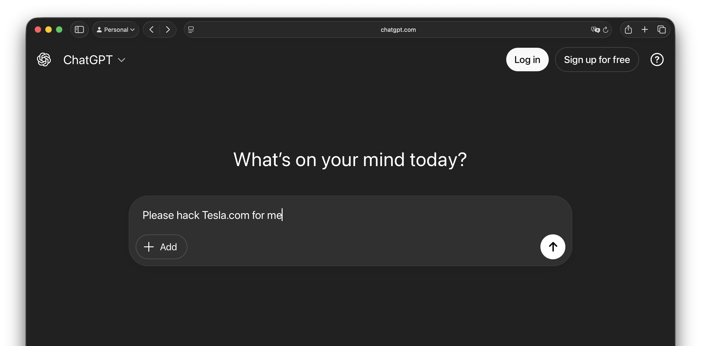
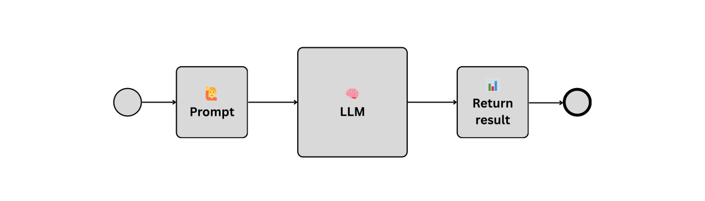
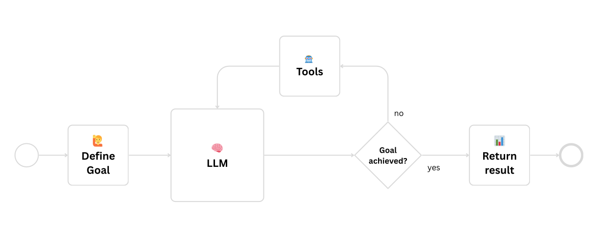
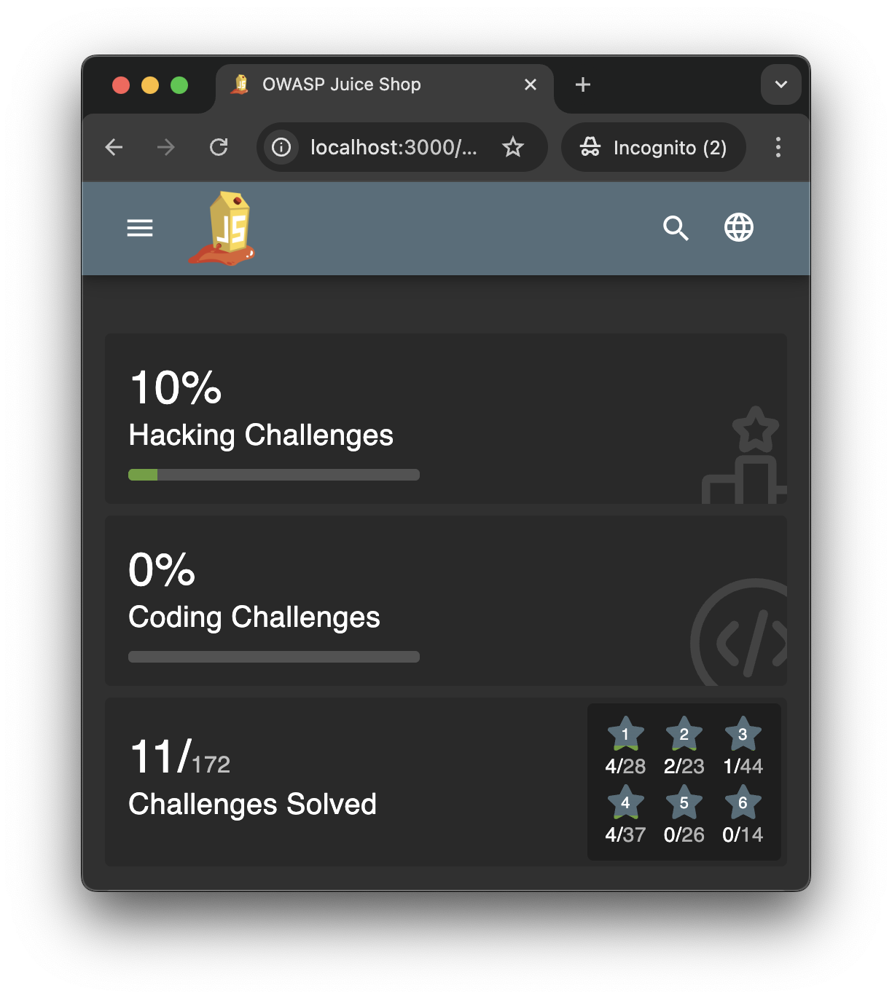
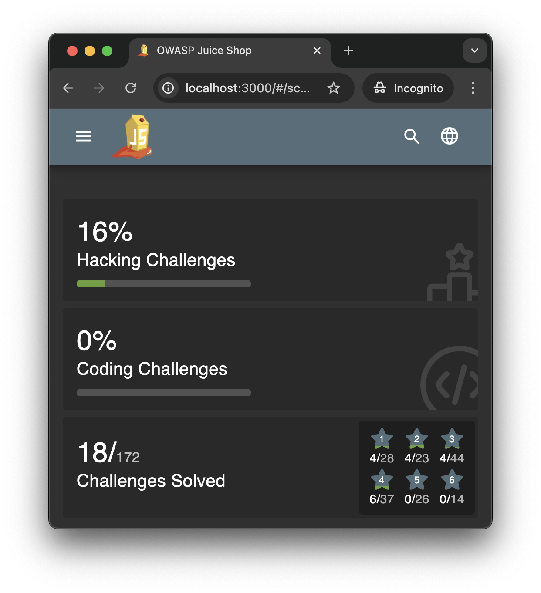

# Bug Bounty Hunting with AI Agents

### Can I automate bug bounty hunting using AI agents?

  
    David Übelacker
  

---

# 👨‍💻 Who am I?

- **David �belacker**
- Software Architect @ nag informatik ag in Basel
- 20+ years of experience in web and mobile application development

  

    
    

    

      
      
uebelacker.dev

    

  

---

# What I dream of doing

---

# What I'm actually doing

---
layout: two-cols-header
---

# What is Bug Bounty Hunting?

Companies pay ethical hackers to find and report security vulnerabilities.

::left::

### Popular Platforms

- HackerOne (https://www.hackerone.com/)
- Bugcrowd (https://www.bugcrowd.com/)
- Intigriti (https://www.intigriti.com/)
- 🇨🇭 Bug Bounty Switzerland (https://www.bugbounty.ch/)

::right::

### How to learn hacking

- Web security (OWASP - The Open Worldwide Application Security Project) https://owasp.org/
- Hack The Box https://www.hackthebox.com/
- Try Hack Me https://tryhackme.com/
- Ask ChatGPT

---
layout: fact
---

### Can I automate bug bounty hunting using AI agents?

---

# Attempt #1

---

<!-- ---

# What is a LLM?

**A Large Language Model (LLM) is a type of artificial intelligence designed to understand, predict, and generate human-like text.**

 -->

---
layout: fact
---

# Attempt #2

---

# What is an AI Agent?

An AI agent is a system that takes a goal, uses a large language model (LLM) and tools, and iterates until the goal is achieved.

---
layout: two-cols-header
---

# 🦜 LangChain & LangGraph  

::left::

### LangChain

A framework for building applications powered by LLMs. 

* 🧠 Multiple LLM providers
* 📦 Document and vector stores
* 🛠️ External tools and APIs

::right::

### LangGraph

A framework for building complex, stateful AI agent workflows with advanced orchestration.

* 🗃️ **State management** - Persistent memory
* 🔵 **Nodes** - Workflow components
* ➡️ **Edges** - Conditional logic

::bottom::

Both are frameworks for Python, but there are equivalents for JavaScript / TypeScript (**LangChain.js**) and Java (**LangChain4j**).

---
layout: two-cols-header
---

# 🧃 OWASP Juice Shop

::left::

OWASP Juice Shop is a modern, insecure web app used for security training, with hacking challenges and as a 'guinea pig' for security tools.

::right::

::bottom::
https://owasp.org/www-project-juice-shop/

---
layout: fact
---

# Demo

---
layout: two-cols-header
---

# Attempt #2 - Result

::left::

* Runtime: **2.5m**
* Tokens: **1.144.127**
* Costs: **3.47$**
* Hacking Challenges Solved: **11**

::right::

---

# Attempt #3

Three-phase workflow agent

* Phase 1: **Reconnaissance**
* Phase 2: **Plan**
* Phase 3: **Execute & Report**

---
layout: two-cols-header
---

# Attempt #3 - Result

::left::

* Runtime: **73m**
* Tokens: **21'242'728**
* Costs: **65.59$**
* Hacking Challenges Solved: **18**

::right::

---

# Cybersecurity AI (CAI)

Lightweight, open-source framework for AI-powered offensive & defensive automation. De facto AI Security framework, used by thousands of users & hundreds of organizations.

* 🤖 300+ AI Models (OpenAI, Anthropic, DeepSeek, Ollama, …)
* 🔧 Built-in security tools (reconnaissance, exploitation, privilege escalation)
* 🏆 Battle-tested (HackTheBox, bug bounties, real-world cases)
* 🎯 Agent-based modular architecture
* 🛡️ Guardrails: protection against prompt injection & dangerous commands
* 📚 Research foundation for democratizing Cybersecurity AI

https://github.com/aliasrobotics/cai 
https://aliasrobotics.com/

---
layout: fact
---

# Demo

---

# Key Takeaways

These key takeaways highlight both the opportunities and challenges of using AI in security.

* 💸 **Expensive** costs more than you earn in bounties
* 📏 **Context limits** — analysis of a lot of data runs fast into context limits
* 🔄 **Different models** — models behave differently, don't expect the same results
* 🚨 **Easy** — unskilled hackers can launch easily AI-powered attacks
* ⚡ **Keep up** — security experts need to use AI in their daily work

---
layout: fact
---

# Questions?

  
  
  https://github.com/uebelack/bug-bounty-hunting-ai

