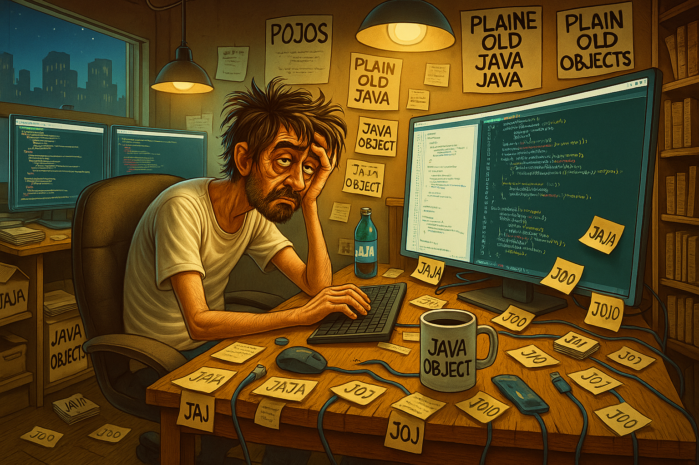
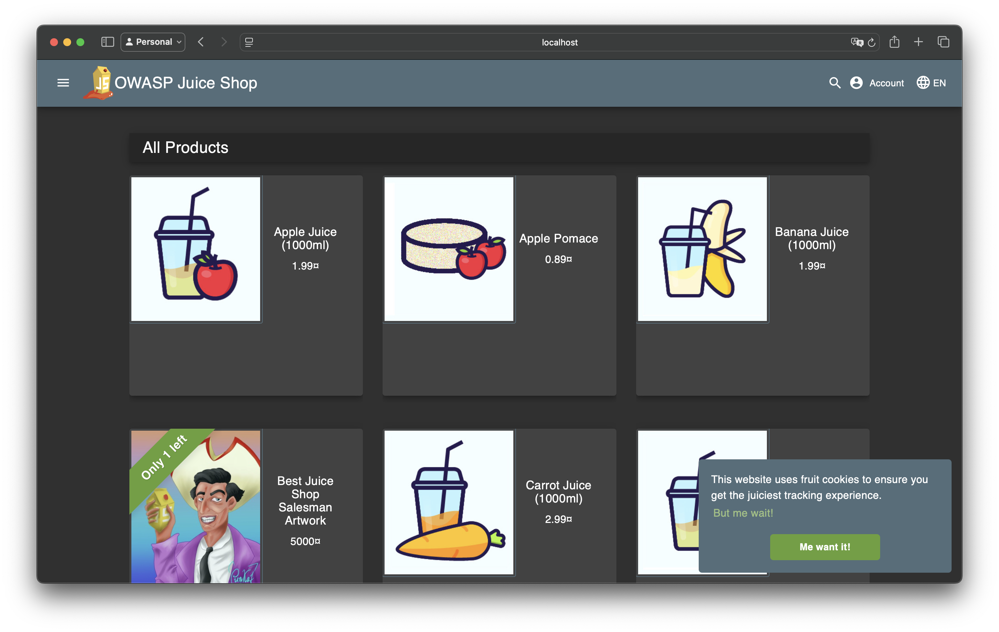
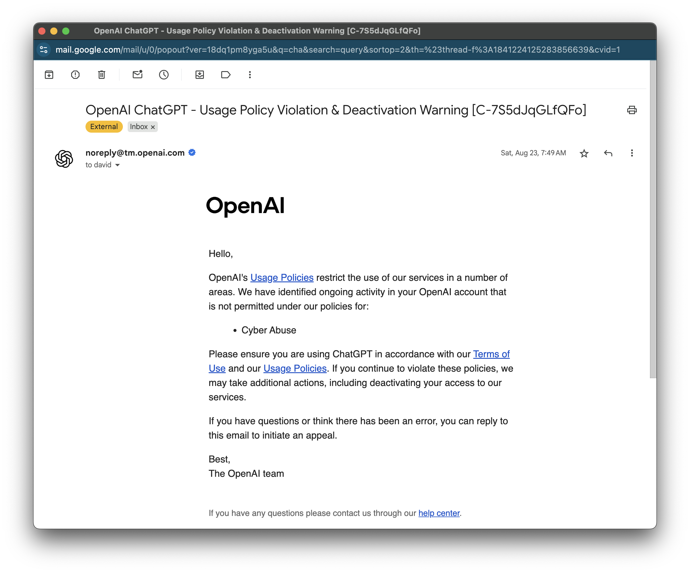
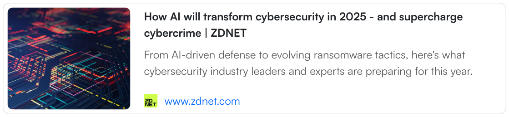
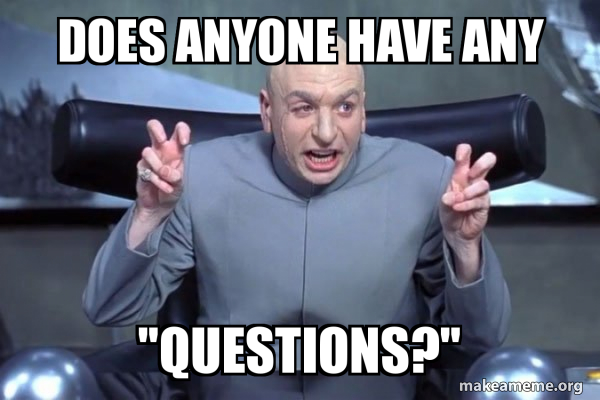

# Bug Bounty Hunting with AI Agents

### Can AI Agents Automate Bug Bounty Hunting?

  
    David Übelacker
  

---

# 👨‍💻 Who am I?

- **David �belacker**
- Software Architect @ nag informatik ag in Basel
- 20+ years of experience in web and mobile application development

  

    
    

    

      
      
uebelacker.dev

    

  

---

# What I dream of doing

---

# What I'm actually doing

---
layout: two-cols-header
---

# What is Bug Bounty Hunting?

Companies pay ethical hackers to find and report security vulnerabilities.

::left::

### Why?

- Improves security 🔐
- Prevents cyberattacks 🚨
- Rewards hackers 💰

 

### How does it work?

- Hackers find bugs 🐞
- Report them responsibly 📩
- Get rewarded 🎉

::right::

### Popular Platforms

- HackerOne (https://www.hackerone.com/)
- Bugcrowd (https://www.bugcrowd.com/)
- Intigriti (https://www.intigriti.com/)
- 🇨🇭 Bug Bounty Switzerland (https://www.bugbounty.ch/)

---
layout: two-cols-header
---

# How to learn hacking

You can learn hacking by understanding cybersecurity fundamentals, practicing ethical hacking on platforms like Hack The Box and TryHackMe, exploring web security (OWASP Top 10), and developing problem-solving skills to identify and fix vulnerabilities.

::left::

- Web security (OWASP - The Open Worldwide Application Security Project) https://owasp.org/
- Hack The Box https://www.hackthebox.com/
- Try Hack Me https://tryhackme.com/
- Ask ChatGPT

::right::

---
layout: fact
---

# Attempt #1

---

---
layout: two-cols-header
---

# What is an LLM?

**A Large Language Model (LLM) is a type of artificial intelligence designed to understand, predict, and generate human-like text.**

::left::

Large Language Models are limited

* 🛑 They are **static** – once trained, they don’t increase their knowledge
* 🧠 They **can’t memorize** new information afterwards
* 🔀 They **can't handle** tasks that require multiple steps

::right::

But we can build things around them to make these limitations less of a problem. ✨

- 📚 **Retrieval-Augmented Generation (RAG)** as memory or domain specific knowledge
- 🔌 **Tools & APIs** (e.g. Model Context Protocols) for real-world actions
- 🤖 **AI Agents** for multi-step workflows

---
layout: two-cols-header
---

# 🦜 LangChain & LangGraph  

::left::

### LangChain

A framework for building applications powered by LLMs. 

* 🧠 Multiple LLM providers
* 📦 Document and vector stores
* 🛠️ External tools and APIs

::right::

### LangGraph

A framework for building complex, stateful AI agent workflows with advanced orchestration.

- 🗃️ **State management** - Persistent memory across steps
- 🔵 **Nodes** - Workflow components
- ➡️ **Edges** - Conditional logic

::bottom::

Both are frameworks for Python, but there are equivalents for JavaScript / TypeScript (**LangChain.js**) and Java (**LangChain4j**).

---
layout: fact
---

# Attempt #2

---

# News

  
  
  

---
layout: fact
---

# Attempt #3

---
layout: center
---

# Conclusion TBD

---

  

