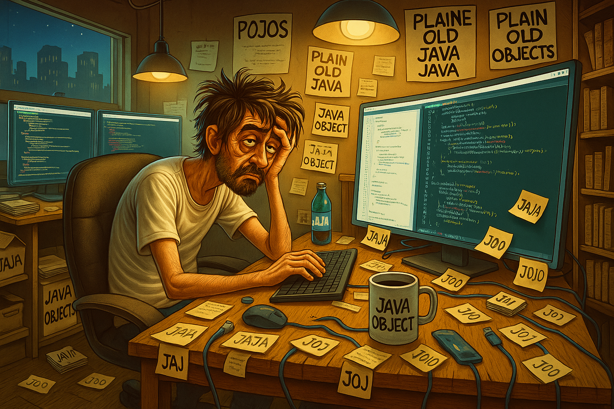
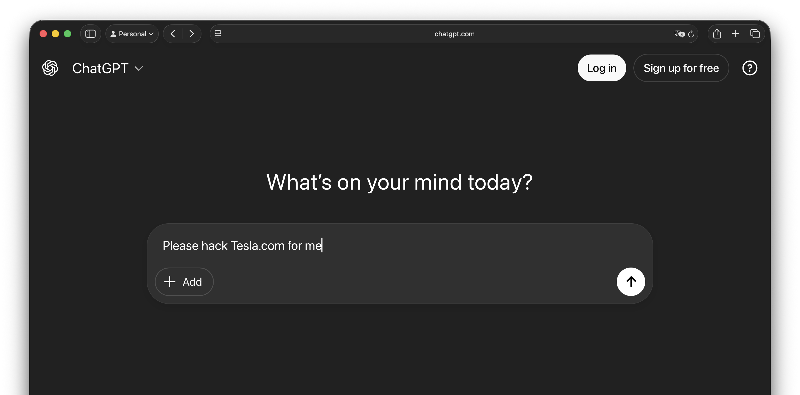
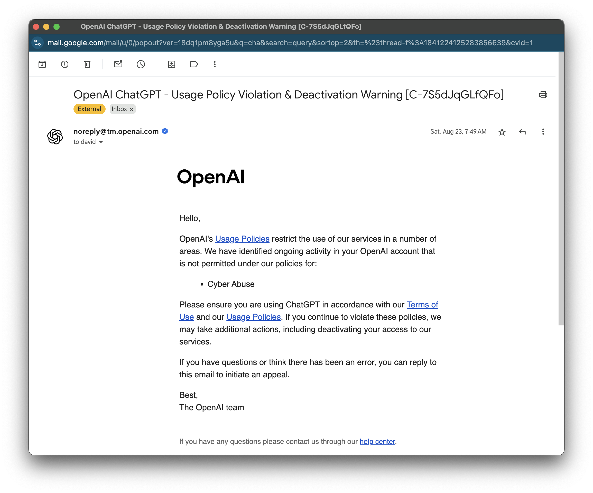
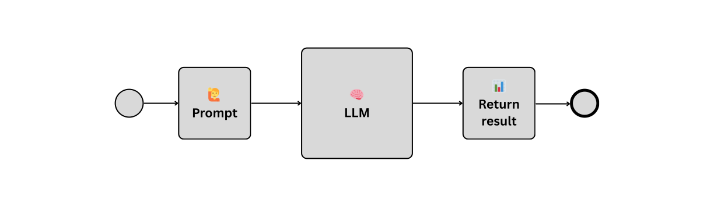
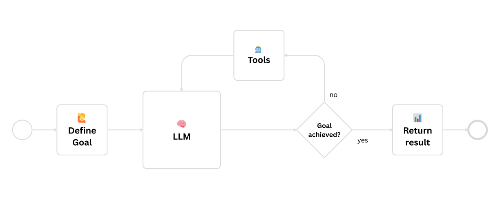
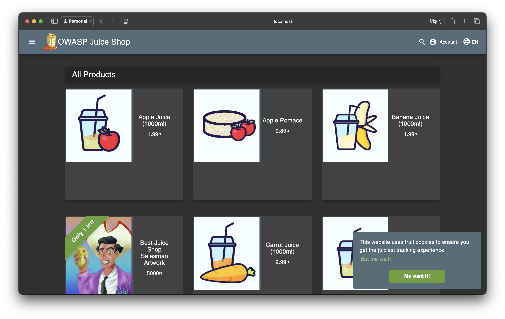
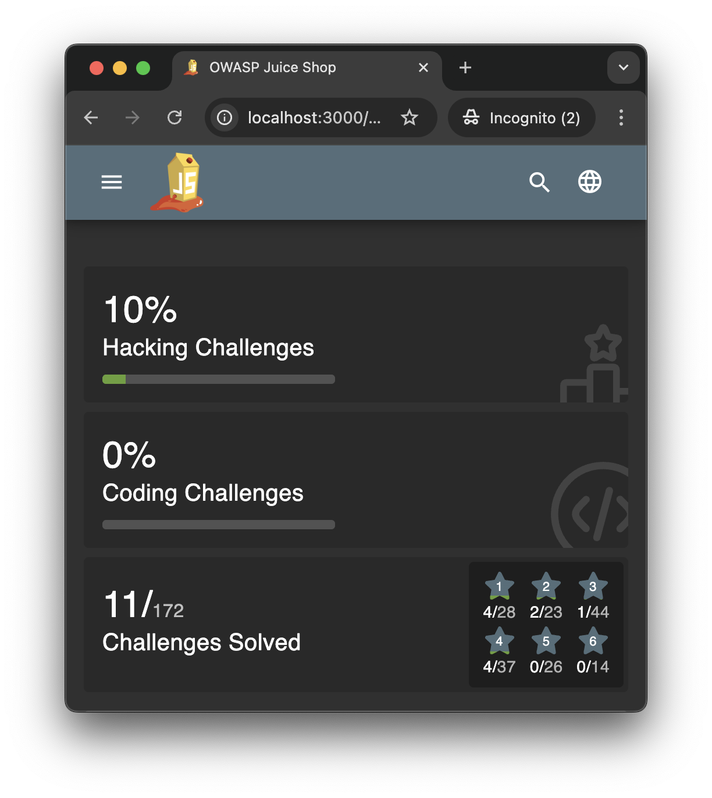
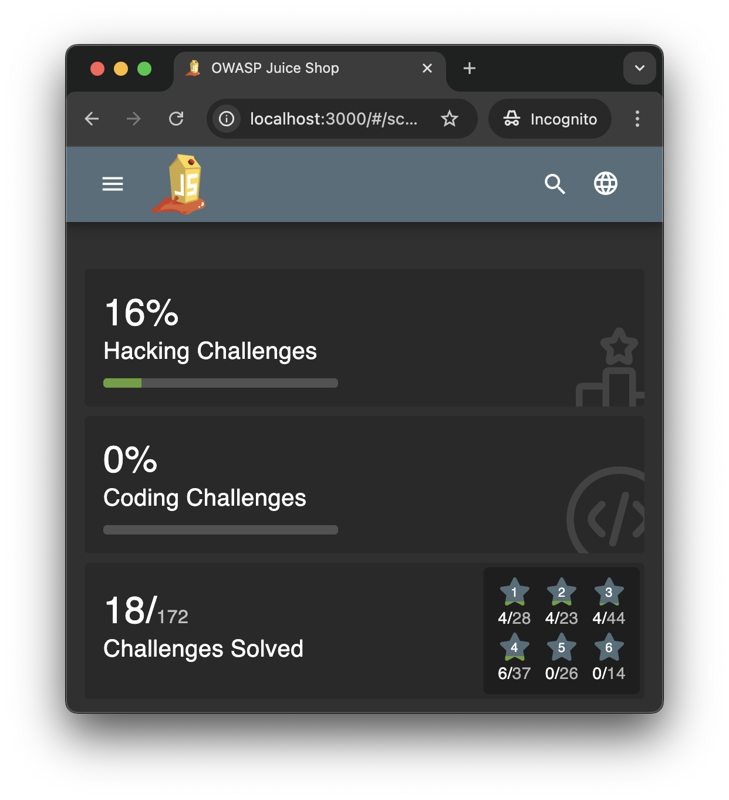

# Caza de Bug Bounties con Agentes de IA

### ¿Puedo automatizar la caza de bug bounties usando agentes de IA?

  
    David Übelacker
  

---

# 👨‍💻 ¿Quién soy?

- **David Übelacker**
- Arquitecto de Software @ nag informatik ag en Basilea
- Más de 20 años de experiencia en desarrollo de aplicaciones web y móviles

  

    
    

    

      
      
uebelacker.dev

    

  

---

# Lo que sueño hacer

---

# Lo que realmente hago

---
layout: two-cols-header
---

# ¿Qué es la Caza de Bug Bounties?

Las empresas le pagan a hackers éticos para encontrar y reportar vulnerabilidades de seguridad.

::left::

### Plataformas Populares

- HackerOne (https://www.hackerone.com/)
- Bugcrowd (https://www.bugcrowd.com/)
- Intigriti (https://www.intigriti.com/)
- 🇨🇭 Bug Bounty Switzerland (https://www.bugbounty.ch/)

::right::

### Cómo aprender hacking

- Seguridad web (OWASP - The Open Worldwide Application Security Project) https://owasp.org/
- Hack The Box https://www.hackthebox.com/
- Try Hack Me https://tryhackme.com/
- Preguntale a ChatGPT

---
layout: fact
---

### ¿Puedo automatizar la caza de bug bounties usando agentes de IA?

---

# Intento #1

---

<!-- ---

# What is a LLM?

**A Large Language Model (LLM) is a type of artificial intelligence designed to understand, predict, and generate human-like text.**

 -->

---
layout: fact
---

# Intento #2

---

# ¿Qué es un Agente de IA?

Un agente de IA es un sistema que toma un objetivo, usa un modelo de lenguaje grande (LLM) y herramientas, e itera hasta que se logra el objetivo.

---
layout: two-cols-header
---

# 🦜 LangChain & LangGraph  

::left::

### LangChain

Un framework para construir aplicaciones potenciadas por LLMs.

* 🧠 Múltiples proveedores de LLM
* 📦 Almacenamiento de documentos y vectores
* 🛠️ Herramientas externas y APIs

::right::

### LangGraph

Un framework para construir flujos de trabajo complejos y con estado para agentes de IA con orquestación avanzada.

* 🗃️ **Gestión de estado** - Memoria persistente
* 🔵 **Nodos** - Componentes del flujo de trabajo
* ➡️ **Aristas** - Lógica condicional

::bottom::

Ambos son frameworks para Python, pero hay equivalentes para JavaScript / TypeScript (**LangChain.js**) y Java (**LangChain4j**).

---
layout: two-cols-header
---

# 🧃 OWASP Juice Shop

::left::

OWASP Juice Shop es una aplicación web moderna e insegura usada para entrenamiento en seguridad, con desafíos de hacking y como 'conejillo de indias' para herramientas de seguridad.

::right::

::bottom::
https://owasp.org/www-project-juice-shop/

---
layout: fact
---

# Demo

---
layout: two-cols-header
---

# Intento #2 - Resultado

::left::

* Tiempo de ejecución: **2.5m**
* Tokens: **1.144.127**
* Costo: **3.47$**
* Desafíos de Hacking Resueltos: **11**

::right::

---

# Intento #3

Agente de flujo de trabajo de tres fases

* Fase 1: **Reconocimiento**
* Fase 2: **Planificación**
* Fase 3: **Ejecución e Informe**

---
layout: two-cols-header
---

# Intento #3 - Resultado

::left::

* Tiempo de ejecución: **73m**
* Tokens: **21'242'728**
* Costo: **65.59$**
* Desafíos de Hacking Resueltos: **18**

::right::

---

# Cybersecurity AI (CAI)

Framework liviano y de código abierto para automatización ofensiva y defensiva potenciada por IA. El framework de facto para Seguridad con IA, usado por miles de usuarios y cientos de organizaciones.

* 🤖 Más de 300 Modelos de IA (OpenAI, Anthropic, DeepSeek, Ollama, …)
* 🔧 Herramientas de seguridad integradas (reconocimiento, explotación, escalada de privilegios)
* 🏆 Probado en combate (HackTheBox, bug bounties, casos del mundo real)
* 🎯 Arquitectura modular basada en agentes
* 🛡️ Protecciones: prevención contra inyección de prompts y comandos peligrosos
* 📚 Base de investigación para democratizar la IA en Ciberseguridad

https://github.com/aliasrobotics/cai 
https://aliasrobotics.com/

---
layout: fact
---

# Demo

---

# Conclusiones Clave

Estas conclusiones destacan tanto las oportunidades como los desafíos de usar IA en seguridad.

* 💸 **Costoso** — cuesta más de lo que ganás en recompensas
* 📏 **Límites de contexto** — el análisis de muchos datos rápidamente alcanza los límites de contexto
* 🔄 **Diferentes modelos** — los modelos se comportan diferente, no esperes los mismos resultados
* 🚨 **Fácil** — hackers sin experiencia pueden lanzar ataques potenciados por IA fácilmente
* ⚡ **Mantenerse actualizado** — los expertos en seguridad necesitan usar IA en su trabajo diario

---
layout: fact
---

# ¿Preguntas?

  
  
  https://github.com/uebelack/bug-bounty-hunting-ai

---
layout: image
image: /images/sponsors.png
---
